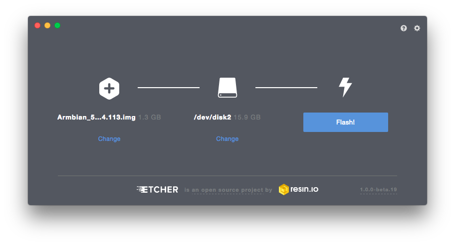

# Single-Board Computer Hadoop Cluster
##### _Andrew Pyle | IFSC 7370 | April 2017_


Let's set up a physical Hadoop 2 cluster with single-board Linux Debian computers! I will be using 1 [Raspberry Pi 1 (Model B)](https://www.raspberrypi.org/products/model-b/) and two [Orange Pi One](http://linux-sunxi.org/Orange_Pi_One) boards. By the end of this journal, we will have a ethernet connected Hadoop 2 cluster of three single-board computers. This will demonstrate a simple implementation of the Hadoop 2 ecosystem.

##### Materials

I am using the following items to create the cluster:

* 1 [Raspberry Pi Model B](https://www.raspberrypi.org/products/model-b/)
* 2 [Orange Pi Ones](http://linux-sunxi.org/Orange_Pi_One)
* For each single-board computer
  * Sandisk Ultra 16 GB Class 10 micro SD card ([Amazon](https://www.amazon.com/gp/product/B010Q57SEE/ref=oh_aui_detailpage_o00_s00?ie=UTF8&psc=1))
  ([Speed Ratings Info](https://kb.sandisk.com/app/answers/detail/a_id/1996/~/difference-between-speed-class%2C-uhs-speed-class%2C-and-speed-ratings))
  * 5V 2A USB Power supply
  * USB-DC barrel plug cable ([Amazon](http://a.co/dzPdzaR))
* Network Interface
  * Ethernet switch and CAT5 cable
  _Note: USB WiFi Dongles could work, but are less reliable_
* Display and HDMI-DVI cable

##### Boot up the Orange Pis
###### 24 March 2017

I am using the Raspberry Pi for another project currently, so I will start this project setup with the Orange Pi One boards.

I purchased 2 boards from [AliExpress.com](https://www.aliexpress.com/item/Orange-Pi-One-H3-Quad-core-Support-ubuntu-linux-and-android-mini-PC-Beyond-Raspberry-Pi/32603308880.html), along with a Sandisk Ultra 16 GB Class 10 micro SD card from [Amazon](https://www.amazon.com/gp/product/B010Q57SEE/ref=oh_aui_detailpage_o00_s00?ie=UTF8&psc=1) for each.


Each Orange Pi One requires a 5V 2A power supply with a DC barrel plug ([4.0mm/1.7mm - center positive](http://linux-sunxi.org/Orange_Pi_One)). I used a [USB-DC barrel plug cable from Amazon](http://a.co/dzPdzaR) so I could use a USB power supply that I had lying around the house.


###### SD Card Integrity

First, we need to ensure the integrity of the SD cards.
> Many scam artists try to market small flash disks as large ones by changing the appearance of the disk. We will use a software test to verify the size of the disk we have. I am using [F3 by Digirati](http://oss.digirati.com.br/f3/) (GPL v3). It runs on Windows, OS X, Linux, and other operating systems. The website includes a very straightforward instructions regarding it's use.

_(Note: I am using MacOS Sierra for the following commands, so if you are using a non-Unix-based OS, note that your commands will be different.)_

Download and unzip the program, then compile it for your system.

```bash
$ cd f3-6.0

$ ls
LICENSE		f3fix.c		f3write.h2w	libutils.c	version.h
Makefile	f3probe.c	libdevs.c	libutils.h
README.md	f3read.1	libdevs.h	log-f3wr
changelog	f3read.c	libprobe.c	utils.c
f3brew.c	f3write.c	libprobe.h	utils.h

$ make
cc -std=c99 -Wall -Wextra -pedantic -MMD -ggdb   -c -o utils.o utils.c
cc -std=c99 -Wall -Wextra -pedantic -MMD -ggdb   -c -o f3write.o f3write.c
cc -o f3write utils.o f3write.o -lm
cc -std=c99 -Wall -Wextra -pedantic -MMD -ggdb   -c -o f3read.o f3read.c
cc -o f3read utils.o f3read.o
```

F3 uses two commands to verify the flash memory: f3write and f3read. The f3write command writes blocks of data to the disk, and f3read reads the data written. In our case, the output will show if the card's claimed capacity matches its usable capacity.

Run f3write on the disk's location in the file system. This can take a while. (Note: if you are using macOS as I am, the location is at /Volumes/your_disk by default.)
```bash
$ ./f3write /Volumes/"NO NAME"
Free space: 14.83 GB
Creating file 1.h2w ... OK!                         
Creating file 2.h2w ... OK!                         
Creating file 3.h2w ... OK!                         
Creating file 4.h2w ... OK!                         
Creating file 5.h2w ... OK!                         
Creating file 6.h2w ... OK!                         
Creating file 7.h2w ... OK!                         
Creating file 8.h2w ... OK!                         
Creating file 9.h2w ... OK!                         
Creating file 10.h2w ... OK!                         
Creating file 11.h2w ... OK!                        
Creating file 12.h2w ... OK!                        
Creating file 13.h2w ... OK!                        
Creating file 14.h2w ... OK!                        
Creating file 15.h2w ... OK!                        
Free space: 0.00 Byte
Average writing speed: 9.79 MB/s
```

>_Note: I received the following error when executing f3write the first time. I just retried the f3write command, and execution was successful. I am not sure what caused the error, and a quick Google search did not return any help. I will just keep the info in mind._
>```bash
>$ ./f3write /Volumes/"NO NAME"
>Free space: 14.83 GB
>Creating file 1.h2w ... 0.29% -- 10.00 MB/s
>
>f3write: Write to file /Volumes/NO NAME/1.h2w failed: Input/output error
>```

And run f3read to verify the data written.
```bash
$ ./f3read /Volumes/"NO NAME"
                  SECTORS      ok/corrupted/changed/overwritten
Validating file 1.h2w ... 2097152/        0/      0/      0
Validating file 2.h2w ... 2097152/        0/      0/      0
Validating file 3.h2w ... 2097152/        0/      0/      0
Validating file 4.h2w ... 2097152/        0/      0/      0
Validating file 5.h2w ... 2097152/        0/      0/      0
Validating file 6.h2w ... 2097152/        0/      0/      0
Validating file 7.h2w ... 2097152/        0/      0/      0
Validating file 8.h2w ... 2097152/        0/      0/      0
Validating file 9.h2w ... 2097152/        0/      0/      0
Validating file 10.h2w ... 2097152/        0/      0/      0
Validating file 11.h2w ... 2097152/        0/      0/      0
Validating file 12.h2w ... 2097152/        0/      0/      0
Validating file 13.h2w ... 2097152/        0/      0/      0
Validating file 14.h2w ... 2097152/        0/      0/      0
Validating file 15.h2w ... 1733888/        0/      0/      0

  Data OK: 14.83 GB (31094016 sectors)
Data LOST: 0.00 Byte (0 sectors)
	       Corrupted: 0.00 Byte (0 sectors)
	Slightly changed: 0.00 Byte (0 sectors)
	     Overwritten: 0.00 Byte (0 sectors)
Average reading speed: 22.27 MB/s
```
Great! no files are listed in the 'corrupted' column above, so we should be good.

If your disk shows files in the 'corrupted' category or a much smaller capacity than advertised, ask for your money back. See F3's website for more specifics on the program's use and functionality.

###### Flash the OS
The next step is to write the operating system for the orange pi to a microSD card, called "flashing" the card.

We will be installing the [Armbian distribution](https://www.armbian.com/orange-pi-one/) of Debian Jessie. They also host a Ubuntu Xenial image as well.

>Shenzhen Xunlong CO., Limited, the makers of the Orange Pi, host their own [OS images](http://www.orangepi.org/downloadresources/) for the Orange Pi One, but they are the same images as for another model, the Orange Pi PC. I have read that the image is not fully supported by the hardware of the One, while Armbian's image is customized for the One. [See linux-sunxi](http://linux-sunxi.org/Xunlong_Orange_Pi_One_%26_Lite) for details.

Download and unzip the OS image. I used [The Unarchiver](http://unarchiver.c3.cx/unarchiver) for mac to unzip the .7z file. The OS image file is highlighted.

Armbian offers a [GPG signature](https://docs.armbian.com/User-Guide_Getting-Started/) for authentication of the OS image download, if you want to check that out. The [process](http://notes.jerzygangi.com/the-best-pgp-tutorial-for-mac-os-x-ever/) is quite involved however.

##### 26 March 2017
We are will be using [Etcher](https://etcher.io) to flash the microSD card. It is a simple interface available for many OSes.



Just choose the Armbian image and the microSD card. The card was auto selected for me. My Armbian image was named as follows. Ensure that you have the correct filename.
```
Armbian_5.25_Orangepione_Debian_jessie_default_3.4.113
```

Etcher gave a success message, so we can now insert the microSD card into the Orange Pi and begin the first boot.


Now, just load the microSD into the Orange Pi board, connect a USB keyboard and display, and connect power. I'm using a HDMI-DVI connection.

###### Error!
At this point, we should see a red power light and the Pi should boot up. However, I see no lights at all. This is a problem!

After measuring some voltages with a multimeter, It seems that the issue is the USB-DC power cable. I can measure 5V from the power supply, but no voltage from the cable connector. I will get another cable and try to boot from the Armbian image again.

##### 27 March 2017


# TODO:
* Pics:
  * Raspbery Pi
