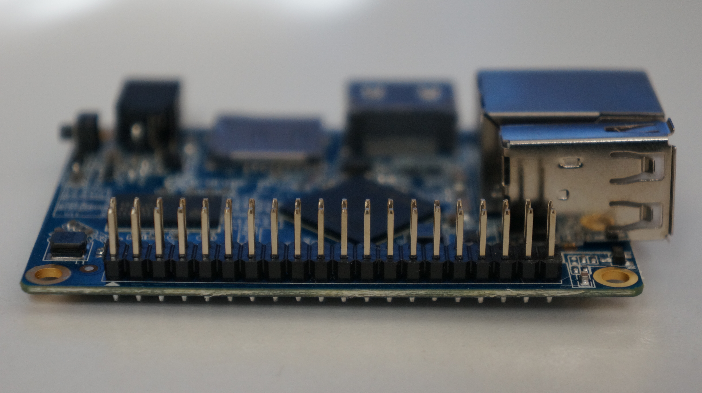
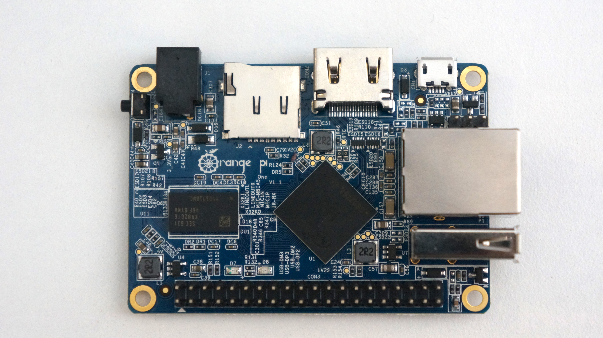
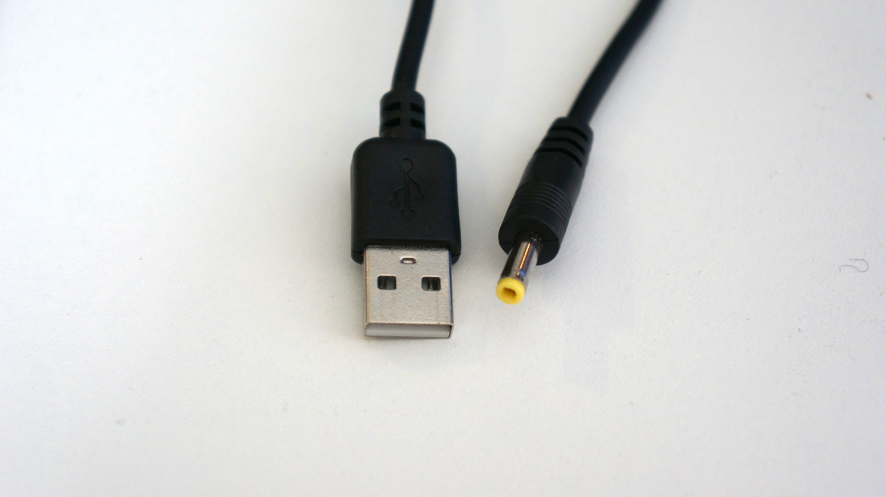
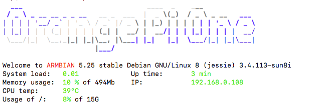
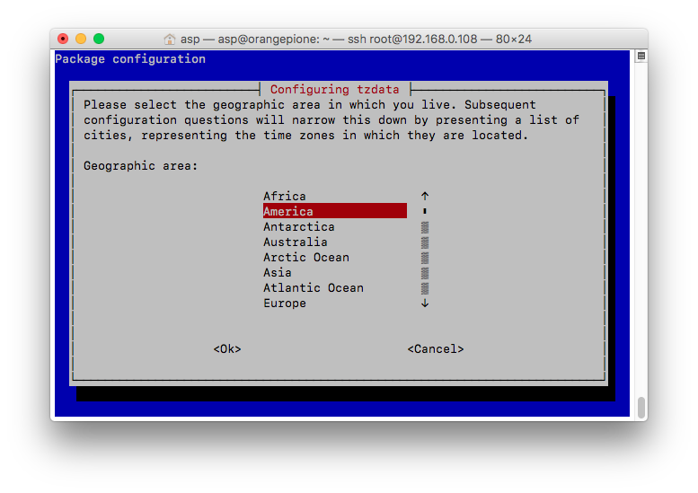

# Single-Board Computer Hadoop Cluster
###### Andrew Pyle | IFSC 7370 | April 2017



Let's set up a physical Hadoop 2 cluster with single-board Linux computers! I will be using 1 [Raspberry Pi 1 (Model B)](https://www.raspberrypi.org/products/model-b/) and two [Orange Pi One](http://linux-sunxi.org/Orange_Pi_One) boards. By the end of this journal, we will have a ethernet connected Hadoop 2 cluster of three single-board computers. This setup will not be powerful enough for production use, but it will demonstrate a simple implementation of the Hadoop 2 ecosystem for learning purposes.

## Table of Contents
1. [Materials](#materials)
1. [Orange Pi](#orange-pi)
    1. [Install the Operating System](#install-the-operating-system)
    1. [SD Card Integrity](#sd-card-integrity)
    1. [Flash the OS](#flash-the-os)
    1. [Error!](#error!)
    1. [New Power Cables](#new-power-cables)
    1. [Boot Up](#boot-up)
    1. [Login with Secure Shell     (SSH)](#login-with-secure-shell-(ssh))
    1. [Configure System](#configure-system)
    1. [Filesystem Resizing](#filesystem-resizing)
    1. [More Configuration](#more-configuration)


## Materials

I am using the following items to create the cluster:

* 1 [Raspberry Pi Model B](https://www.raspberrypi.org/products/model-b/)
* 2 [Orange Pi Ones](http://linux-sunxi.org/Orange_Pi_One)
* For each single-board computer
  * Sandisk Ultra 16 GB Class 10 micro SD card ([Amazon](https://www.amazon.com/gp/product/B010Q57SEE/ref=oh_aui_detailpage_o00_s00?ie=UTF8&psc=1))
  ([Speed Ratings Info](https://kb.sandisk.com/app/answers/detail/a_id/1996/~/difference-between-speed-class%2C-uhs-speed-class%2C-and-speed-ratings))
  * 5V 2A USB Power supply
  * USB-DC barrel plug cable ([Amazon](http://a.co/dzPdzaR))
* Network Interface
  * Ethernet switch and CAT5 cable
  _Note: USB WiFi Dongles could work, but are less reliable_
* Display and HDMI-DVI cable

## Orange Pi
### Install the Operating System
#### 24 March 2017

My Raspberry Pi is currently in use for another project, so I will start this project setup with the Orange Pi One boards.

I purchased 2 boards from [AliExpress.com](https://www.aliexpress.com/item/Orange-Pi-One-H3-Quad-core-Support-ubuntu-linux-and-android-mini-PC-Beyond-Raspberry-Pi/32603308880.html), along with a Sandisk Ultra 16 GB Class 10 micro SD card from [Amazon](https://www.amazon.com/gp/product/B010Q57SEE/ref=oh_aui_detailpage_o00_s00?ie=UTF8&psc=1) for each.



Each Orange Pi One requires a 5V 2A power supply with a DC barrel plug ([4.0mm/1.7mm - center positive](http://linux-sunxi.org/Orange_Pi_One)). I used a [USB-DC barrel plug cable from Amazon](http://a.co/dzPdzaR) so I could use a USB power supply that I had lying around the house.



##### SD Card Integrity

First, we need to ensure the integrity of the SD cards.
> Many scam artists try to market small flash disks as large ones by changing the appearance of the disk. We will use a software test to verify the size of the disk we have. I am using [F3 by Digirati](http://oss.digirati.com.br/f3/) (GPL v3). It runs on Windows, OS X, Linux, and other operating systems. The website includes a very straightforward instructions regarding it's use.

_(Note: I am using MacOS Sierra for the following commands, so if you are using a non-Unix-based OS, note that your commands will be different.)_

Download and unzip the program, then compile it for your system.

```bash
$ cd f3-6.0

$ ls
LICENSE		f3fix.c		f3write.h2w	libutils.c	version.h
Makefile	f3probe.c	libdevs.c	libutils.h
README.md	f3read.1	libdevs.h	log-f3wr
changelog	f3read.c	libprobe.c	utils.c
f3brew.c	f3write.c	libprobe.h	utils.h

$ make
cc -std=c99 -Wall -Wextra -pedantic -MMD -ggdb   -c -o utils.o utils.c
cc -std=c99 -Wall -Wextra -pedantic -MMD -ggdb   -c -o f3write.o f3write.c
cc -o f3write utils.o f3write.o -lm
cc -std=c99 -Wall -Wextra -pedantic -MMD -ggdb   -c -o f3read.o f3read.c
cc -o f3read utils.o f3read.o
```

F3 uses two commands to verify the flash memory: f3write and f3read. The f3write command writes blocks of data to the disk, and f3read reads the data written. In our case, the output will show if the card's claimed capacity matches its usable capacity.

Run f3write on the disk's location in the file system. This can take a while. (Note: if you are using macOS as I am, the location is at /Volumes/your_disk by default.)
```bash
$ ./f3write /Volumes/"NO NAME"
Free space: 14.83 GB
Creating file 1.h2w ... OK!                         
Creating file 2.h2w ... OK!                         
Creating file 3.h2w ... OK!                         
Creating file 4.h2w ... OK!                         
Creating file 5.h2w ... OK!                         
Creating file 6.h2w ... OK!                         
Creating file 7.h2w ... OK!                         
Creating file 8.h2w ... OK!                         
Creating file 9.h2w ... OK!                         
Creating file 10.h2w ... OK!                         
Creating file 11.h2w ... OK!                        
Creating file 12.h2w ... OK!                        
Creating file 13.h2w ... OK!                        
Creating file 14.h2w ... OK!                        
Creating file 15.h2w ... OK!                        
Free space: 0.00 Byte
Average writing speed: 9.79 MB/s
```

>_Note: I received the following error when executing f3write the first time. I just retried the f3write command, and execution was successful. I am not sure what caused the error, and a quick Google search did not return any help. I will just keep the info in mind._
>```bash
>$ ./f3write /Volumes/"NO NAME"
>Free space: 14.83 GB
>Creating file 1.h2w ... 0.29% -- 10.00 MB/s
>
>f3write: Write to file /Volumes/NO NAME/1.h2w failed: Input/output error
>```

And run f3read to verify the data written.
```bash
$ ./f3read /Volumes/"NO NAME"
                  SECTORS      ok/corrupted/changed/overwritten
Validating file 1.h2w ... 2097152/        0/      0/      0
Validating file 2.h2w ... 2097152/        0/      0/      0
Validating file 3.h2w ... 2097152/        0/      0/      0
Validating file 4.h2w ... 2097152/        0/      0/      0
Validating file 5.h2w ... 2097152/        0/      0/      0
Validating file 6.h2w ... 2097152/        0/      0/      0
Validating file 7.h2w ... 2097152/        0/      0/      0
Validating file 8.h2w ... 2097152/        0/      0/      0
Validating file 9.h2w ... 2097152/        0/      0/      0
Validating file 10.h2w ... 2097152/        0/      0/      0
Validating file 11.h2w ... 2097152/        0/      0/      0
Validating file 12.h2w ... 2097152/        0/      0/      0
Validating file 13.h2w ... 2097152/        0/      0/      0
Validating file 14.h2w ... 2097152/        0/      0/      0
Validating file 15.h2w ... 1733888/        0/      0/      0

  Data OK: 14.83 GB (31094016 sectors)
Data LOST: 0.00 Byte (0 sectors)
	       Corrupted: 0.00 Byte (0 sectors)
	Slightly changed: 0.00 Byte (0 sectors)
	     Overwritten: 0.00 Byte (0 sectors)
Average reading speed: 22.27 MB/s
```
Great! no files are listed in the 'corrupted' column above, so the microSD cards should be good.

If your disk shows files in the 'corrupted' category or a much smaller capacity than advertised, ask for your money back. See F3's website for more specifics on the program's use and functionality.

##### Flash the OS
The next step is to write the operating system for the orange pi to a microSD card, called "flashing" the card.

We will be installing the [Armbian distribution](https://www.armbian.com/orange-pi-one/) of Debian Jessie. It is a solely CLI image, which means that it uses a text-based command-line interface. They host a Ubuntu Xenial image with CLI only and GUI desktop interface versions as well.

>Shenzhen Xunlong CO., Limited, the makers of the Orange Pi, host their own [OS images](http://www.orangepi.org/downloadresources/) for the Orange Pi One, but they are the same images as for another model, the Orange Pi PC. I have read that the image is not fully supported by the hardware of the One, while Armbian's image is customized for the One. [See linux-sunxi](http://linux-sunxi.org/Xunlong_Orange_Pi_One_%26_Lite) for details.

Download and unzip the OS image. I used [The Unarchiver](http://unarchiver.c3.cx/unarchiver) for mac to unzip the .7z file. The OS image file is highlighted.

Armbian offers a [GPG signature](https://docs.armbian.com/User-Guide_Getting-Started/) for authentication of the OS image download, if you want to check that out. The [process](http://notes.jerzygangi.com/the-best-pgp-tutorial-for-mac-os-x-ever/) is quite involved however.

##### References
###### Tutorials
* [ORANGE PI ONE – QUICK START GUIDE by Travis Straub](https://tdstraub.wordpress.com/2016/04/05/orange-pi-one-quick-start-guide/)
* [Orange Pi One Board Quick Start Guide with Armbian Debian based Linux Distribution](http://www.cnx-software.com/2016/03/16/orange-pi-one-board-quick-start-guide-with-armbian-debian-based-linux-distribution/)

###### Technical
* [Sunxi - Orange Pi One Hardware Information](https://linux-sunxi.org/Orange_Pi_Lite)
* [Armbian - Orange Pi One Page](https://www.armbian.com/orange-pi-one/)
* [Armbian Docs - Getting Started Guide](https://docs.armbian.com/User-Guide_Getting-Started/)


#### 26 March 2017
We will be using [Etcher](https://etcher.io) to flash the microSD card. It is a simple interface available for many OSes.


Just choose the Armbian image and the microSD card. The card was auto selected for me. My Armbian image was named as follows. Ensure that you have the correct filename.
```
Armbian_5.25_Orangepione_Debian_jessie_default_3.4.113
```

Etcher gave a success message, so we can now insert the microSD card into the Orange Pi and begin the first boot.


Now, just load the microSD into the Orange Pi board, connect a USB keyboard and display, and connect power. I'm using a HDMI-DVI connection.

##### Error!
At this point, we should see a red power light and the Pi should boot up. However, I see no lights at all. This is a problem!

After measuring some voltages with a multimeter, it seems that the issue is the USB-DC power cable. I can measure 5V from the power supply, but no voltage from the cable connector. I will get another cable and try to boot from the Armbian image again.

#### 29 March 2017
##### New Power Cables
Two new cables from Amazon ([this one](http://a.co/gDyAZoq) and [this one](http://a.co/ftKETZe)) arrived today. I will try to boot the Armbian image again. I am skeptical that this will work, since it seems like a cable is the least likely piece of the computer system to fail.

Let's connect the Orange Pi as above, and try to boot!

##### Boot Up

LIGHTS! It does seem as if the cable was bad. (I'll try to get my money back.) I am getting a green light and blinking red light. The DVI monitor showed an error message and then a blank screen.
> I wish I'd gotten a video here of the light sequence during the boot process, but I didn't have the camera ready.

This all means the resolution coming from the Orange Pi is unusable by the monitor. This also means that I currently have no idea what is going on with the Orange Pi Boot process. A quick Google search didn't turn up anything specific, so I will try to boot with another power supply.

>The Orange Pi is extremely picky about the power supply. Even a supply marked 5V 2A will fail frequently. It seems that the voltage must be extremely stable over all amperages, and the amperage must not fall far below 2A at any time during operation. It seems that the best solution for the Orange Pi power supply is to buy the  5V 3A power supply from [AliExpress](https://www.aliexpress.com/store/product/orange-pi-orange-pi-plus-Power-Adapter-5V-2A-Power-Supply-Micro-USB-Charger/1553371_32248555041.html). They have both US and European versions.

I use the [Plugable 4-port USB Hub](http://plugable.com/products/USB2-HUB4BC) to power my Raspberry Pi with no issues, so I will give that a try as the power supply.


It works! I got a brief look at the boot process before the monitor went blank due to resolution issues (probably), and the green light went solid with occasional flashes (the light is on the lower right corner of the board, by the GPIO pins). The red light started solid and then went out.

##### Login with Secure Shell (SSH)

Since the monitor is blank, it's not helping us complete the initial boot process. Thankfully SSH is enabled by default on the Orange Pi! SSH is a method of remotely logging in to a Unix-based (e.g. Linux) operating system. INSERT SSH REFERENCE.

Since the Orange Pi booted up while connected to the network, it received an IP Address by DHCP. I can check that at my router's homepage.
>(There are other methods to ascertain the IP address of the devices on your home network, like [Fing](https://www.fing.io/) for iOS and Android).

SSH into the Orange Pi One. The default password for root on Armbian is '1234'. Add the RSA fingerprint to the list of known hosts if asked. This registers the Orange Pi hardware with your computer.

```bash
$ ssh root@[ip_address]   # Replace [ip_address] with the IP
                          # address of your Orange Pi
```
```bash
root@192.168.0.108 password:    #1234
```
A nice login screen is displayed upon SSH connection.




##### Configure System

Now that we can boot the Orange Pi up, lets get the system configured for use.

Follow the initial boot prompts from Armbian, like changing the root password, making a new user account, and setting the display settings.

The h3disp program is provided to set the display settings.

```bash
root@orangepione:$ sudo h3disp
Usage: h3disp [-h/-H] -m [video mode] [-d] [-c [0-2]]

############################################################################

 This is a tool to set the display resolution of your Orange
 Pi by patching script.bin.

 In case you use an HDMI-to-DVI converter please use the -d switch.

 The resolution can be set using the -m switch. The following resolutions
 are currently supported:

    480i	use "-m 480i" or "-m 0"
    576i	use "-m 576i" or "-m 1"
    480p	use "-m 480p" or "-m 2"
    576p	use "-m 576p" or "-m 3"
    720p50	use "-m 720p50" or "-m 4"
    720p60	use "-m 720p60" or "-m 5"
    1080i50	use "-m 1080i50" or "-m 6"
    1080i60	use "-m 1080i60" or "-m 7"
    1080p24	use "-m 1080p24" or "-m 8"
    1080p50	use "-m 1080p50" or "-m 9"
    1080p60	use "-m 1080p60" or "-m 10"
    1080p25	use "-m 1080p25" or "-m 11"
    1080p30	use "-m 1080p30" or "-m 12"
    1080p24_3d	use "-m 1080p24_3d" or "-m 13"
    720p50_3d	use "-m 720p50_3d" or "-m 14"
    720p60_3d	use "-m 720p60_3d" or "-m 15"
    1080p24_3d	use "-m 1080p24_3d" or "-m 23"
    720p50_3d	use "-m 720p50_3d" or "-m 24"
    720p60_3d	use "-m 720p60_3d" or "-m 25"
    1080p25	use "-m 1080p25" or "-m 26"
    1080p30	use "-m 1080p30" or "-m 27"
    4kp30	use "-m 4kp30" or "-m 28"
    4kp25	use "-m 4kp25" or "-m 29"
    800x480	use "-m 800x480" or "-m 31"
    1024x768	use "-m 1024x768" or "-m 32"
    1280x1024	use "-m 1280x1024" or "-m 33"
    1360x768	use "-m 1360x768" or "-m 34"
    1440x900	use "-m 1440x900" or "-m 35"
    1680x1050	use "-m 1680x1050" or "-m 36"

 Two examples:

    'h3disp -m 1080p60 -d' (1920x1080@60Hz DVI)
    'h3disp -m 720i' (1280x720@30Hz HDMI)

 You can also specify the colour-range for your HDMI-display with the -c switch.

 The following values for -c are currently supported:

    0 -- RGB range 16-255 (Default, use "-c 0")
    1 -- RGB range 0-255 (Full range, use "-c 1")
    2 -- RGB range 16-235 (Limited video, "-c 2")

############################################################################
```

My monitor is 1280x1024 @ 60 hz with a DVI adapter. I am not sure why the DVI adapter makes a difference, but it has its own '-d' flag. I will use the following command:

```bash
root@orangepione:$ h3disp -m 1280x1024 -d
```

After rebooting, the monitor shows the correct image, but it still shows a resoloution error message. After trying several other formats (all worse outcome than the above setting), I found that if I push the menu button on the monitor before it goes blank, it will interrupt the sleep timeout process, and after closing the menu, the error is gone and the monitor works properly. I can't explain this one, but it seems to work!


#### 30 March 2017
Let's check out some OS parameters before we attempt to begin the Hadoop 2 setup phase.

> I am switching to the non-root user account I created in the installation process. It is always better to operate a CLI OS as a non-root user. It is too easy to unintentionally make a mistake as root, since root has so much power in the OS.

##### Filesystem Resizing

When we flashed the Armbian OS image onto the microSD card, the image wasn't nearly as large as the whole card's storage capacity. If it were, we'd have a problem actually running the OS! But we do want the Orange Pi's file system to have access to all the storage capacity on the microSD card once we've booted into the OS. Luckily, Armbian automatically resizes the filesystem to use the entire capacity of the card it's installed on, leaving ~1% as free space.

Run the following commands to check.

```bash
asp@orangepione:$ fdisk -l

Disk /dev/mmcblk0: 14.9 GiB, 15931539456 bytes, 31116288 sectors
Units: sectors of 1 * 512 = 512 bytes
Sector size (logical/physical): 512 bytes / 512 bytes
I/O size (minimum/optimal): 512 bytes / 512 bytes
Disklabel type: dos
Disk identifier: 0x9781060c

Device         Boot Start      End  Sectors  Size Id Type
/dev/mmcblk0p1       2048 30493951 30491904 14.6G 83 Linux
```
Notice that the size of the only partition (/dev/mmcblk0p1) is close to the entire size of the microSD card, which is 16 GB in my case.
```bash
asp@orangepione:$ df -h
Filesystem      Size  Used Avail Use% Mounted on
/dev/mmcblk0p1   15G  1.1G   14G   8% /
udev             10M     0   10M   0% /dev
tmpfs            99M  4.5M   95M   5% /run
tmpfs           248M     0  248M   0% /dev/shm
tmpfs           5.0M  4.0K  5.0M   1% /run/lock
tmpfs           248M     0  248M   0% /sys/fs/cgroup
tmpfs           248M     0  248M   0% /tmp
log2ram          50M  748K   50M   2% /var/log
tmpfs            50M     0   50M   0% /run/user/1000
```
This output says that the filesystem (/dev/mmcblk0p1) has a size of 15 GB.

##### More Configuration

Next let's set the timezone.
>I am switching back to root user here because the dpkg-reconfigure commands aren't in the $PATH of my created user account, and I didn't want to take the time to add them.
```bash
root@orangepione:$ dpkg-reconfigure tzdata
```
 
```bash
Current default time zone: 'America/Chicago'
Local time is now:      Fri Mar 31 00:25:30 CDT 2017.
Universal Time is now:  Fri Mar 31 05:25:30 UTC 2017.
```

And lastly, I am getting a notification below the login screen that there are updates to install.
```bash
  ___                               ____  _    ___             
 / _ \ _ __ __ _ _ __   __ _  ___  |  _ \(_)  / _ \ _ __   ___
| | | |  __/ _  |  _ \ / _  |/ _ \ | |_) | | | | | |  _ \ / _ \
| |_| | | | (_| | | | | (_| |  __/ |  __/| | | |_| | | | |  __/
 \___/|_|  \__,_|_| |_|\__, |\___| |_|   |_|  \___/|_| |_|\___|
                     |___/                                   

Welcome to ARMBIAN 5.25 stable Debian GNU/Linux 8 (jessie) 3.4.113-sun8i   
System load:   0.03            	Up time:       3 min		
Memory usage:  10 % of 494Mb  	IP:            192.168.0.108
CPU temp:      35°C           	
Usage of /:    7% of 15G   


[ 3 updates to install: apt-get upgrade ]
```
> Linux Debian Note: apt-get is a package manager for the Debian OS. It handles installing programs on the CLI (which is a good thing, because I'd have trouble installing programs from the Internet without it!)
> Run this command for more information. Or see a plain-english description  [here](http://askubuntu.com/questions/222348/what-does-sudo-apt-get-update-do).
>```bash
>$ man apt-get
>```
We will run two commands to install the updates. This one udpates the existing program information. **Be sure to run this one (update) before upgrade, or else you will be upgrading based on outdated package info.**
```bash
root@orangepione:$ apt-get update
```
And this one actually downloads and installs the new versions of the programs.
```bash
root@orangepione:$ apt-get upgrade
```

>These commands can take a **really** long time to complete. Especially if it has not been run in a while. You are updating every single program on your computer at once! Be sure to wait until the command prompt
>```bash
>root@orangepione:$
>```
>appears again before typing new commands.

After a successful upgrade, we are ready to begin the Hadoop 2 installation! Let's pat ourselves on the back for a successful Orange Pi installation!

### Install Hadoop 2
#### 14 April 2017

##### Install Oracle Java
>The install Hadoop part of the journal draws from a tutorial from [Pi Projects](http://www.piprojects.xyz/install-hadoop-java-orange-pi/). Check them out!

We will be installing [Apache Hadoop 2.7.3](http://hadoop.apache.org/releases.html) (released 25 Aug 2016) on the Orange Pi. This is not the most up-to-date version, but there is more information on the Internet about Hadoop 2.7.x than either 2.8.x or 3.x.x.

Java is required for Hadoop, as much of the functionality of the system is rooted in executing Java code. Let's install [Oracle Java JDK 8](http://www.oracle.com/technetwork/java/javase/downloads/jdk8-downloads-2133151.html). From what I've read online Oracle's JDK is more performant for Hadoop clusters than Open JDK or other alternatives. See Apache info [here](https://wiki.apache.org/hadoop/HadoopJavaVersions).

I could not find a download path from Oracle to `wget` the tar archive directly to the Orange Pi, so I downloaded Oracle JDK for Linux ARM 32-bit processor onto my MacBook and transferred the tar archive to the Orange Pi with `scp`:
```bash
$ scp filename username@destination_host:/path/to/file
```
On the Orange Pi, unpack the archive to the `/opt` directory with the `-C`flag:
```bash
sudo tar xzvf jdk-8u121-linux-arm32-vfp-hflt.tar.gz -C /opt
```
Next, we will setup the Java installation with the following commands from [Pi Projects](http://www.piprojects.xyz/install-hadoop-java-orange-pi/). I do not entirely understand this process, but these commands set up Oracle Java 8 JDK as the default `java` and `javac` for our environment by creating `symlinks` from our installation to `/usr/bin/java` and `/usr/bin/java`.
```bash
$ sudo update-alternatives --install /usr/bin/javac javac /opt/jdk1.8.0_121/bin/javac 1

$ sudo update-alternatives --install /usr/bin/java java /opt/jdk1.8.0_121/bin/java 1

# Allows interactive selection of default java location
$ sudo update-alternatives --config javac
$ sudo update-alternatives --config java
```
We can see that the symlinks have been made.
```bash
$ ls /usr/bin/java
/usr/bin/java
asp@orangepione:~$ ls -l  /usr/bin/ | grep java
lrwxrwxrwx 1 root root   22 Apr 14 20:17 java -> /etc/alternatives/java
lrwxrwxrwx 1 root root   23 Apr 14 20:17 javac -> /etc/alternatives/javac
```

##### Install Hadoop
First, we will create a user for hadoop's processes in the `sudo` group. This will allow the machines in the cluster to communicate with each other.
```bash
$ sudo addgroup hadoop
$ sudo adduser --ingroup hadoop hduser
$ $ sudo adduser hduser sudo
```
Now we will download Hadoop! Go to http://www.apache.org/dyn/closer.cgi/hadoop/common/hadoop-2.7.3/hadoop-2.7.3.tar.gz and choose the suggested mirror for the download.
I used:
```bash
$ wget http://www.namesdir.com/mirrors/apache/hadoop/common/hadoop-2.7.3/hadoop-2.7.3.tar.gz

sudo tar xzvf hadoop-2.7.3.tar.gz -C /opt
```


# TODO:
* Include References
* Make Headings Consistent
* Complete Table of Contents
* Pics:
  * Brighten Pics
  * Raspbery Pi
  * Monitor error & trick
  * see above blanks
